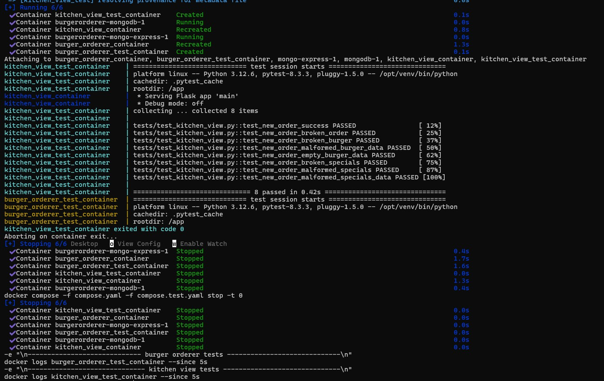

# Grupp 20 Reflektioner - Filip, Leo and Mikko  

## Link to the project:
https://github.com/BonnieToGamer/BurgerOrderer

## Short summary of the functionality testing.
The functionality tests checked how our project reacted if different types of data was sent instead of the correct data type. For example if no data was sent or the wrong burger name etc.

## How the tests was carried out 
We made automated tests that tests different parts of burgerer_orderer and kitchen_view. The tests were created to test the different api endpoints such as /api/getBurgers and /api/getSpecials, and check how they handle different types of data, like a different burger name or specials selections. To start a test you can use the command "make test", this will run through the tests.

## Latest testsession print out:

## Group experiences about automated testing
The testing went generally good. We already had a good understanding of what we should test, the complicated part of automated testing was to actually make the code for the tests. But once we understood how to make the code for one test, the rest of the code was not that hard to complete since it consists of the same code structure for each test.

## The groups individual debugging sessions
The debugging sessions can be viewed in our individual engineering journals.

