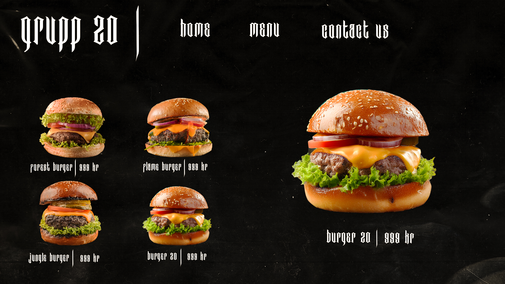
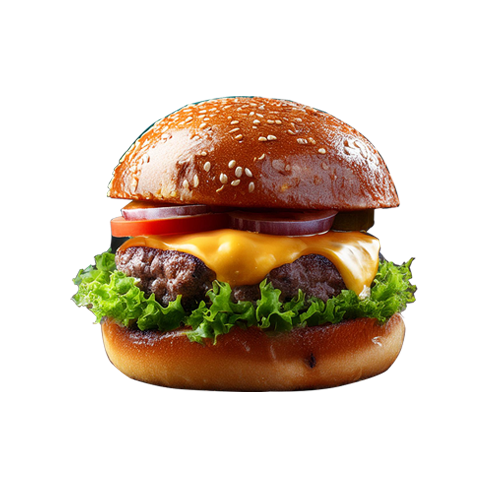
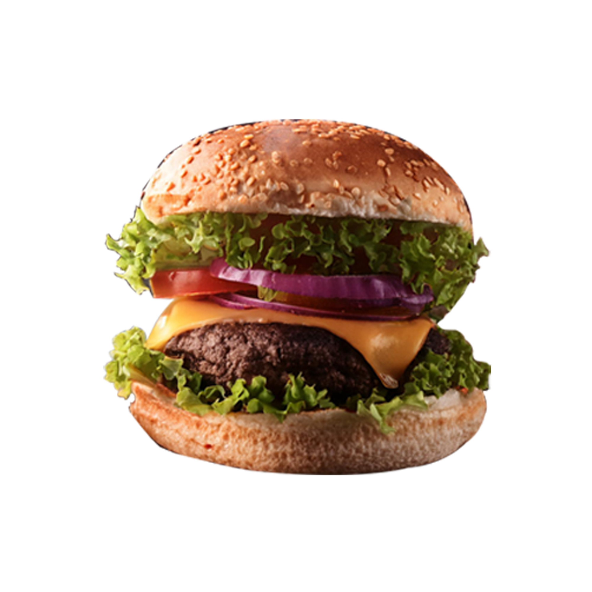
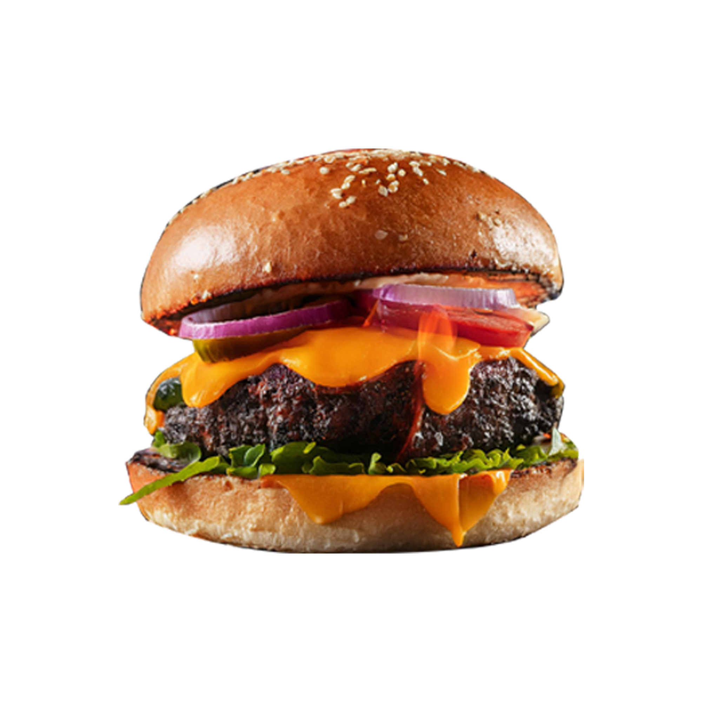
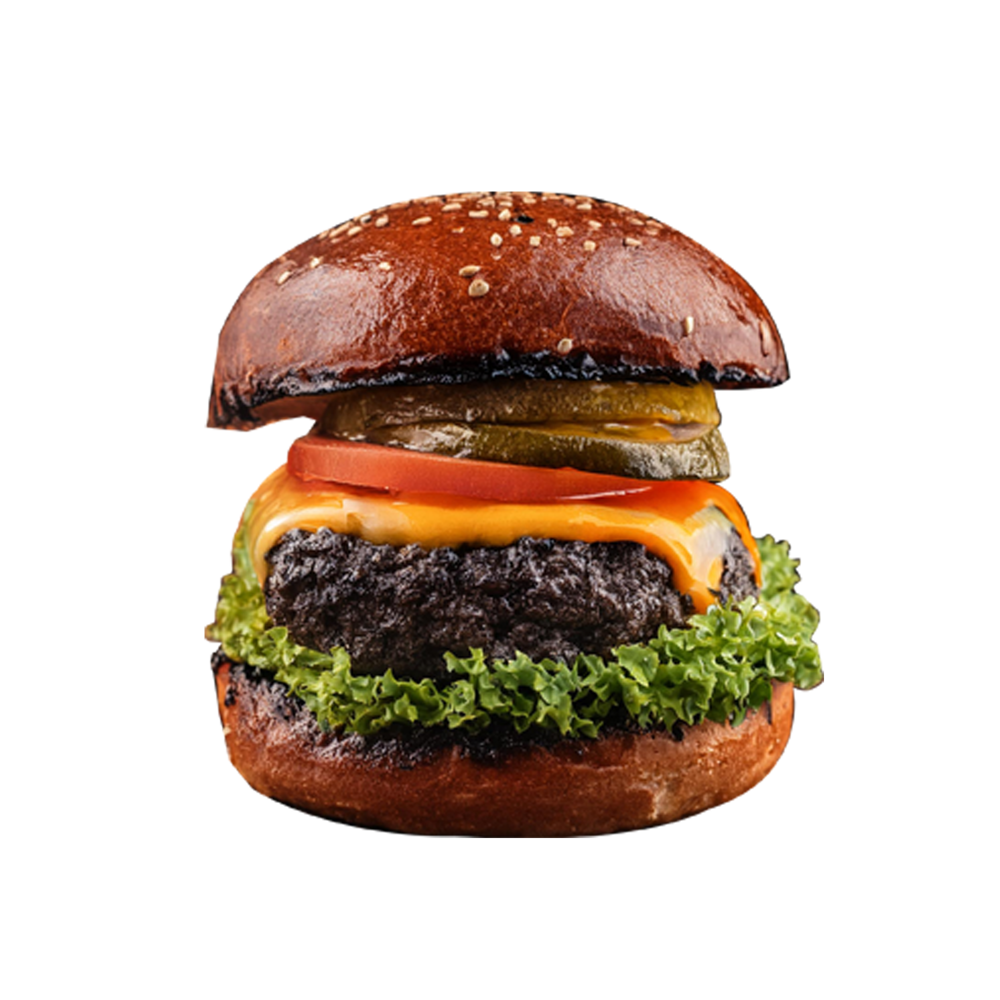
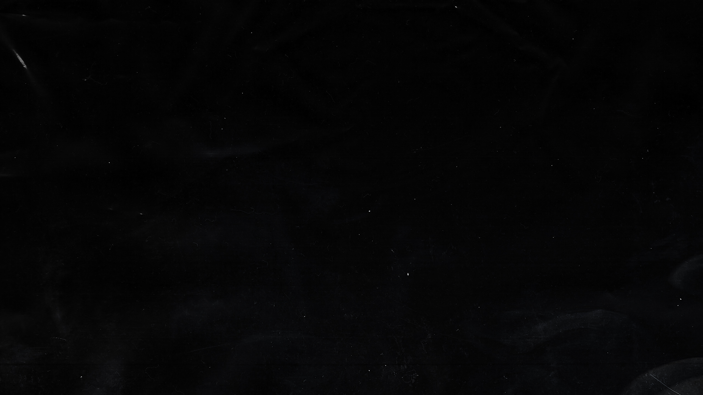

# UI-Plan

## Table of Contents
1. [Design the UI](#design-the-ui)
2. [Objectives](#objectives)
3. [UI Components](#ui-components)

---

## Design the UI
I will start of by making a sketch of how I want the UI to look in Photoshop. This sketch will be used when designing the UI in html and css.
### The Sketch

## Objectives
- Create a user-friendly and Clean UI.

## UI Components
### Font
The font that will be used is "Bad-Boys-font.ttf"
### Logo

### Burger Images

### Background Image

---
